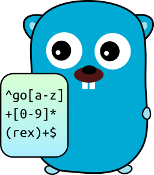
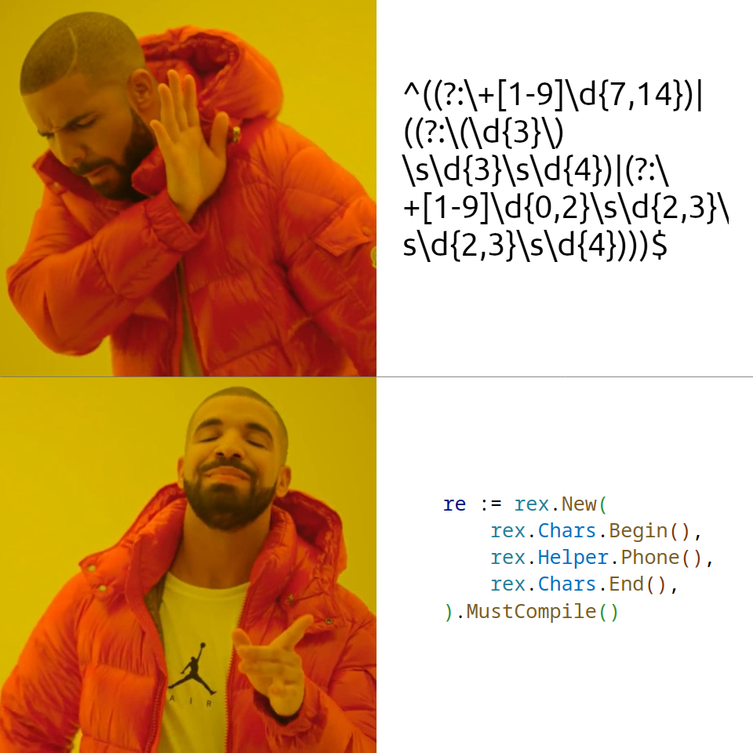

# Rex


[](https://goreportcard.com/report/github.com/hedhyw/rex)
[](https://coveralls.io/github/hedhyw/rex?branch=main)
[](https://pkg.go.dev/github.com/hedhyw/rex?tab=doc)



This is a regular expressions builder for gophers!

## Why?

It makes readability better and helps to construct regular expressions using human-friendly constructions. Also, it allows commenting and reusing blocks, which improves the quality of code.

It is just a builder, so it returns standart [`*regexp.Regexp`](https://pkg.go.dev/regexp#Regexp).

The library supports [groups](#groups), [composits](#simple-composite), [classes](#character-classes), [flags](#flags), [repetitions](#repetitions) and if you want you can even use [raw regular expressions](#raw-regular-expression) in any place. Also it contains a set of [predefined helpers](#helper) for matching phones, emails, etc...

Let's see an example of validating (`some_id[#]`):
```golang
// Using this builder.
re := rex.New(
    rex.Chars.Begin(), // `^`
    // ID should begin with lowercased character.
    rex.Chars.Lower().Repeat().OneOrMore(), // `[a-z]+`
    // ID should contain number inside brackets [#].
    rex.Chars.Single('['),                   // `[`
    rex.Chars.Digits().Repeat().OneOrMore(), // `[0-9]+`
    rex.Chars.Single(']'),                   // `]`
    rex.Chars.End(),                         // `$`
).MustCompile()
```

Yes, it requires more code, but it has its advantages.
> More, but simpler code, fewer bugs.

## Meme



_The picture contains two frame fragments from [the video](https://www.youtube.com/watch?v=uxpDa-c-4Mc)._

## Documentation

```golang
import "github.com/hedhyw/rex/pkg/rex"

func main() {
    rex.New(/* tokens */).MustCompile() // The same as `regexp.MustCompile`.
    rex.New(/* tokens */).Compile() // The same as `regexp.Compile`.
    rex.New(/* tokens */).String() // Get constructed regular expression as a string.
}
```

### Common

Common operators for core operations.

```golang
rex.Common.Raw(raw string) // Raw regular expression.
rex.Common.Text(text string) // Escaped text.
rex.Common.Class(tokens ...dialect.ClassToken) // Include specified characters.
rex.Common.NotClass(tokens ...dialect.ClassToken) // Exclude specified characters.
```

### Character classes

Single characters and classes, that can be used as-is, as well as childs to `rex.CommonClass` or `rex.CommonNotClass`.

```golang
rex.Chars.Begin()                // `^`
rex.Chars.End()                  // `$`
rex.Chars.Any()                  // `.`
rex.Chars.Range('a', 'z')        // `[a-z]`
rex.Chars.Runes("abc")           // `[abc]`
rex.Chars.Single('r')            // `r`
rex.Chars.Unicode(unicode.Greek) // `\p{Greek}`
rex.Chars.UnicodeByName("Greek") // `\p{Greek}`

rex.Chars.Digits()               // `[0-9]`
rex.Chars.Alphanumeric()         // `[0-9A-Za-z]`
rex.Chars.Alphabetic()           // `[A-Za-z]`
rex.Chars.ASCII()                // `[\x00-\x7F]`
rex.Chars.Whitespace()           // `[\t\n\v\f\r ]`
rex.Chars.WordCharacter()        // `[0-9A-Za-z_]`
rex.Chars.Blank()                // `[\t ]`
rex.Chars.Control()              // `[\x00-\x1F\x7F]`
rex.Chars.Graphical()            // `[[:graph:]]`
rex.Chars.Lower()                // `[a-z]`
rex.Chars.Printable()            // `[ [:graph:]]`
rex.Chars.Punctuation()          // `[!-/:-@[-`{-~]`
rex.Chars.Upper()                // `[A-Z]`
rex.Chars.HexDigits()            // `[0-9A-Fa-f]`
```

If you want to combine mutiple character classes, use `rex.Common.Class`:
```golang
// Only specific characters:
rex.Common.Class(rex.Chars.Digits(), rex.Chars.Single('a'))
// It will produce `[0-9a]`.

// All characters except:
rex.Common.NotClass(rex.Chars.Digits(), rex.Chars.Single('a'))
// It will produce `[^0-9a]`.
```

### Groups

Helpers for grouping expressions.

```golang
// Define a captured group. That can help to select part of the text.
rex.Group.Define(rex.Chars.Single('a'), rex.Chars.Single('b')) // (ab)
// A group that defines "OR" condition for given expressions.
// Example: "a" or "rex", ...
rex.Group.Composite(rex.Chars.Single('a'), rex.Common.Text("rex")) // (?:a|rex)

// Define non-captured group. The result will not be captured.
rex.Group.Define(rex.Chars.Single('a')).NonCaptured() // (?:a)
// Define a group with a name.
rex.Group.Define(rex.Chars.Single('a')).WithName("my_name") // (?P<my_name>a)
```

## Flags

```golang
// TODO: https://github.com/hedhyw/rex/issues/31
```

### Repetitions

Helpers that specify how to repeat characters. They can be called on character class tokens.

```golang
RepetableClassToken.Repeat().OneOrMore() // `+`
RepetableClassToken.ZeroOrMore() // `*`
RepetableClassToken.ZeroOrOne() // `?`
RepetableClassToken.EqualOrMoreThan(n int) // `{n,}`
RepetableClassToken.Between(n, m int) // `{n,m}`

// Example:
rex.Chars.Digits().Repeat().OneOrMore() // [0-9]+
rex.Group.Define(rex.Chars.Single('a')).Repeat().OneOrMore() // (a)+
```

## Helper

Common regular expression patters that are ready to use.
> ⚠️ These patterns are likely to be changed in new versions.

```golang
rex.Helper.Phone() // Combines PhoneE164 and PhoneE123.
rex.Helper.PhoneE164() // +155555555
rex.Helper.PhoneE123() // Combines PhoneNationalE123 and PhoneInternationalE123.
rex.Helper.PhoneNationalE123() // (607) 123 4567
rex.Helper.PhoneInternationalE123() // +22 607 123 4567
rex.Helper.HostnameRFC952() // Hostname by RFC-952 (stricter).
rex.Helper.HostnameRFC1123() // Hostname by RFC-1123.
rex.Helper.Email() // Unquoted email pattern, it doesn't check RFC 5322 completely, due to high complexity.
rex.Helper.IP()   // IPv4 or IPv6.
rex.Helper.IPv4() // 127.0.0.1
rex.Helper.IPv6() // 2001:0db8:85a3:0000:0000:8a2e:0370:7334
rex.Helper.MD5Hex() // d41d8cd98f00b204e9800998ecf8427e
rex.Helper.SHA1Hex() // da39a3ee5e6b4b0d3255bfef95601890afd80709
rex.Helper.SHA256Hex() // e3b0c44298fc1c149afbf4c8996fb92427ae41e4649b934ca495991b7852b855
```

## Examples

### Simple email validator

Let's describe a simple email regular expression in order to show the basic functionality (there is a more advanced helper `rex.Helper.Email()`):

```golang
// We can define a set of characters and reuse the block.
customCharacters := rex.Common.Class(
    rex.Chars.Range('a', 'z'), // `[a-z]`
    rex.Chars.Upper(),         // `[A-Z]`
    rex.Chars.Single('-'),     // `\x2D`
    rex.Chars.Digits(),        // `[0-9]`
) // `[a-zA-Z-0-9]`

re := rex.New(
    rex.Chars.Begin(), // `^`
    customCharacters.Repeat().OneOrMore(),

    // Email delimeter.
    rex.Chars.Single('@'), // `@`

    // Allow dot after delimter.
    rex.Common.Class(
        rex.Chars.Single('.'), // \.
        customCharacters,
    ).Repeat().OneOrMore(),

    // Email should contain at least one dot.
    rex.Chars.Single('.'), // `\.`
    rex.Chars.Alphanumeric().Repeat().Between(2, 3),

    rex.Chars.End(), // `$`
).MustCompile()
```

#### Raw regular expression

```golang
rex.New(
    rex.Chars.Begin(), // `^`
    rex.Common.Raw("[a-zA-Z0-9]+"), // `[a-zA-Z0-9]+`
    rex.Chars.Single('@'), // `@`
    rex.Common.Raw("[a-zA-Z0-9]+"), // `[a-zA-Z0-9]+`
    rex.Chars.End(), // `$`
).MustCompile()

// Or even!

rex.New(
    rex.Common.Raw(`^[a-zA-Z\d]+@[a-zA-Z\d]+\.[a-zA-Z\d]{2,3}$`),
).MustCompile()
```

#### Simple composite

```golang
re := rex.New(
    rex.Chars.Begin(),
    rex.Group.Composite(
        // Text matches exact text (symbols will be escaped).
        rex.Common.Text("hello."),
        // OR one or more numbers.
        rex.Chars.Digits().Repeat().OneOrMore(),
    ),
    rex.Chars.End(),
).MustCompile()

re.MatchString("hello.")    // true
re.MatchString("hello")     // false
re.MatchString("123")       // true
re.MatchString("hello.123") // false
```

## Example groups usage

```golang
re := rex.New(
    // Define a named group.
    rex.Group.Define(
        rex.Helper.Phone(),
    ).WithName("phone"),
).MustCompile()

const text = `
E.164:      +15555555
E.123.Intl: (607) 123 4567
E.123.Natl: +22 607 123 4567
`

submatches := re.FindAllStringSubmatch(text, -1)
// submatches[0]: +15555555
// submatches[1]: (607) 123 4567
// submatches[2]: +22 607 123 4567
```

#### More examples

More examples can be found here: [examples_test.go](examples_test.go).
